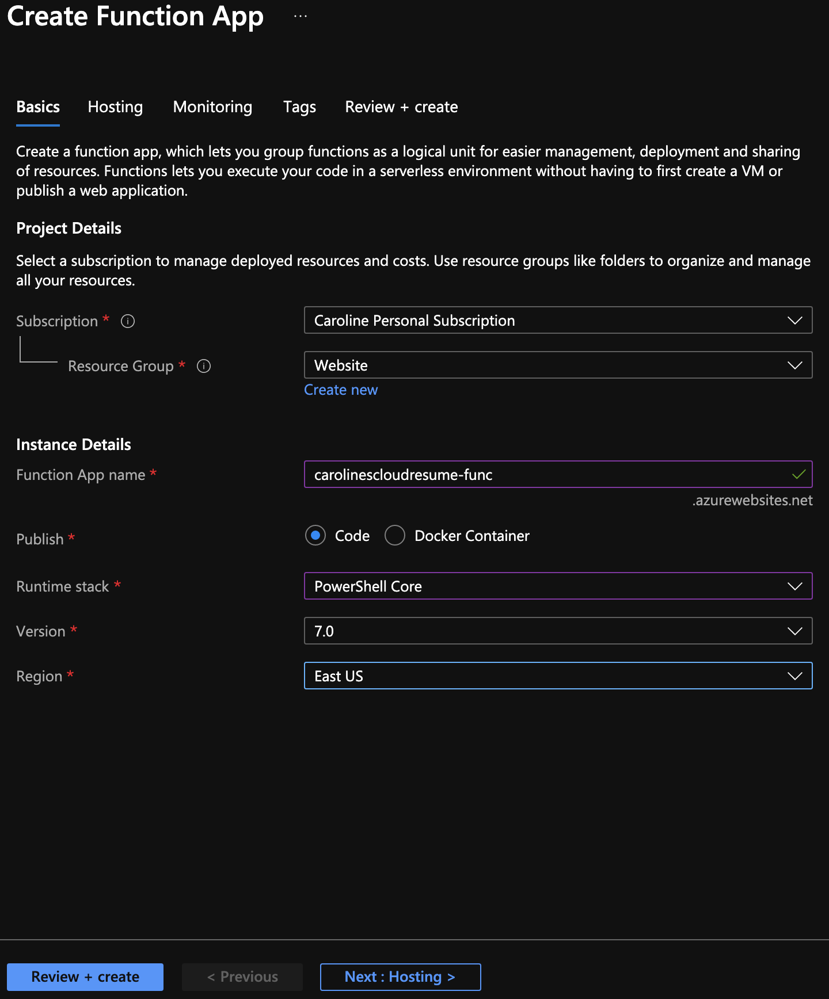
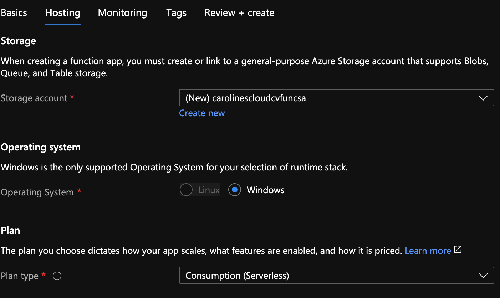
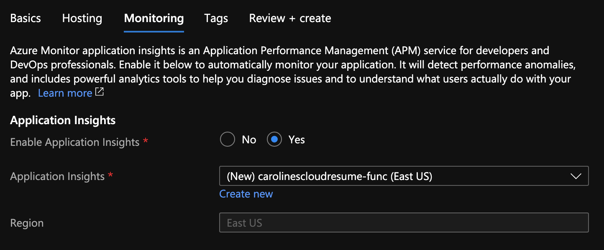
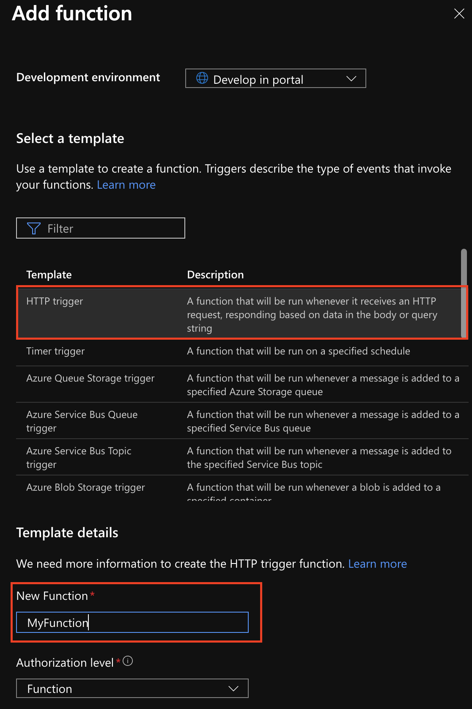
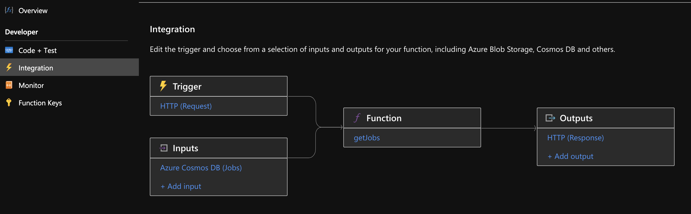

# Azure Functions - General Operations

## Table of Content
  - [Introduction](#introduction)
  - [Creating An Azure Functions App](#creating-an-azure-functions-app)
  - [Creating a new HTTP function](#creating-a-new-http-function)
  - [Integrating Resources with Azure Function](#integrating-resources-with-azure-function)
    - [Input](#input)
    - [Output](#output)
    - [CosmosDB Integration](#cosmosdb-integration)
    - [Storage Queue Integration](#storage-queue-integration)
## Introduction
This document contains instructions on how to perform general operations on Azure functions, such as creating an azure functions app resource, creating a new functions, and integrating an azure function with an external resource.

## Creating An Azure Functions App
1. Go to your site's resource group
2. Click **Add**/**Marketplace**
3. Select or search for **Function App**
4. Make sure that the resource group is the correct one
5. Give your functions app a proper name from [your naming convention](/README.md#pick-a-name-for-your-resources)
6. **Publish**: Code
7. **Runtime Stack**: PowerShell Core
8. **Version**: Pick the latest available
9. **Region**: [Your resources' region](/README.md#pick-a-location)

10. Click on **Next:Hosting >**
11. For **Storage Account** Click *Create New*
12. Give your storage account a proper name following [your naming convention](/README.md#pick-a-name-for-your-resources)
13. Make sure the **Plan Type** is *Consumption (Serverless)*

14. Click **Next: Monitoring >**
15. Select *Yes* for **Enable Application Insight**
16. For **Application Insight** click *Create New*
17. Give your Application Insight account a proper name following [your naming convention](/README.md#pick-a-name-for-your-resources)
18. Make sure the location is the same as [your resources region](/README.md#pick-a-location)
19. Click **OK**

20. Click on **Review + Create**
21. Click on **Create**

## Creating a new HTTP function

For this project, functions will be edited in the portal, therefore there is no VSCode setup.

In your Azure Functions App Resource
1. Click on **Functions**
2. Click **+ Add**
3. For the **Template** select the *HTTP Trigger*
4. Scroll down and enter a function name under **New Function**
5. Click **Add**



## Integrating Resources with Azure Function

Some functions require integration with other resources.

In order to integrate a resources with your function in the Azure Portal:
1. Click on your function
2. On the left hand side, click on **Integration**

Integrations can happen either as an **Input** or an **Output**.



### Input

Input integrations will pass the value of the integrated resource to the the code. The value depends on the resource being integrated.

In PowerShell, inputs are not automatically added to the code (unless they are part of a trigger), but they can be added manually using the name of the integration like this:

``` PowerShell
# Before
# Default param block for HTTP trigger
param($Request, $TriggerMetadata)

# After
# $job added from the integration
param($Request, $TriggerMetadata, $jobs)
```

### Output

Output integration are used to push data out of the Azure function. There are no available parameters for this, but you can user the `Push-OutputBinding` cmdlet as such:

``` PowerShell
Push-OutputBinding -Name MyOutput -Value $MyValue
```

### CosmosDB Integration

Cosmos DB is one of the possible integrations for Azure functions.

In order to integrate a Cosmos DB resources to an Azure function, you must first [create the Cosmos DB](../CosmosDB/CosmosDBSetup.md).

To create the binding:
1. Click on your function
2. On the left hand side, click on **Integration**
3. Choose an **input** (*+ Add Input*) or **output** (*+ Add output*) integration
4. **Binding Type**: Azure Cosmos DB
5. **Document Parameter Name**: This is the name as it appears in your code.
6. **Database Name**: Use the [database created previously](../CosmosDB/CosmosDBSetup.md)
7. **Collection Name**: Enter the appropriate name of the collection you are querying
8. **Cosmos DB account connection**: If one does not exist, click on **new** and, from the drop down, select the appropriate Cosmos DB account

**Note**: Some parameters are not used in this project, but here's what they're for:
- **Document ID**: Returns a specific document. This could be useful for the *getUser* function in this project to guarantee that only one document is returned, in case a duplicate is created.
- **Partition Key**: only needed if a **Document ID** is specified.
- **SQL Query**: An SQL query to return a specific set of documents. For example you could query only jobs for the past 5 years.

### Storage Queue Integration

To create the binding with a storage queue account:
1. Click on your function
2. On the left hand side, click on **Integration**
3. Choose an **output** (*+ Add output*) integration (Storage queues cannot be used as input, unless they are selected as a trigger)
4. **Binding Type**: Azure Queue Storage
5. **Message Parameter Name**: Enter the name of the parameter you want to use in your code
6. **Queue Name**: Enter the name of the queue you want to output to
7. **Storage Account Connection**: Select you storage account where the queue resides or create a new connection to your storage account
