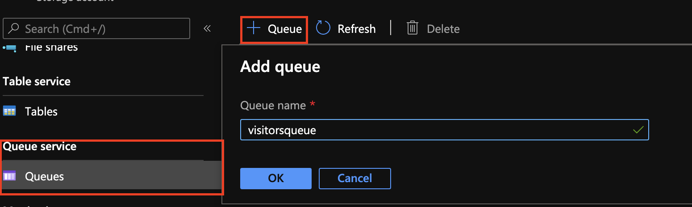

# Azure Storage Configuration

## Table of Content
- [Azure Storage Configuration](#azure-storage-configuration)
  - [Table of Content](#table-of-content)
  - [Introduction](#introduction)
  - [Static Website](#static-website)
  - [Visitors Processing Queue](#visitors-processing-queue)

## Introduction

In order to host the website and handle visitors, you will need an Azure Storage account.

## Static Website

In order to host the static website, you need a storage account with the static website enabled.

1. In the resource group select Add
2. Click on the storage account
3. Give it a globally unique name (preferably related to the name picked earlier)
4. Select the location (the one picked above)
5. Select a **Standard** performance
6. Select a Replication of **Locally-redundant Storage (LRS)**
7. Click on **Review + Create**
8. Click **Create**

When the storage account is created, go to the resource.

1. On the left pane of the resource, click on **Static Website**
2. Click **Enabled**
3. For *Index document name* enter **index.html**
4. For *Error document path* enter **index.html**

You now have properly configured your storage account to accept this website.

## Visitors Processing Queue

In order to handle a theoretically large amount of simultaneous users on the website, the tally will be done thanks to a storage queue. Every new user's IP address will be stored in a storage queue, and the items will be processed one by one by an azure function.

In the storage account you previously created:
1. On the left hand side, go to **Queues**
2. In the main pane, click on **+ Queue**
3. For the **Queue name** enter *visitorsqueue*

