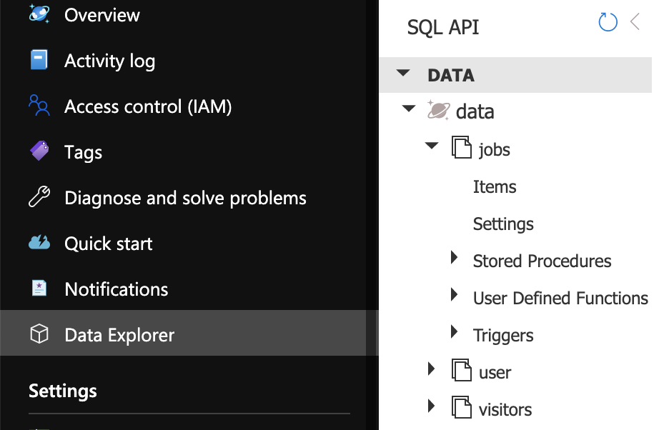

# Cosmos DB

## Table of Content
- [Cosmos DB](#cosmos-db)
  - [Table of Content](#table-of-content)
  - [Introduction](#introduction)
  - [Creating the Cosmos DB Resource](#creating-the-cosmos-db-resource)
  - [Creating the Database and containers](#creating-the-database-and-containers)

## Introduction

This website requires data to be stored in a Cosmos DB SQL database.

## Creating the Cosmos DB Resource
Now, let's create the cosmos database.
1. Go to your site's resource group
2. Click **Add**/**Marketplace**
3. Select or search for **Azure Cosmos DB**
4. Click on **Azure Cosmos DB**
5. Enter an **Account Name** in accordance to [your naming convention](/README.md#pick-a-name-for-your-resources)
6. Select the **Core (SQL)** **API**
7. Select the location [you chose for your resources](/README.md#pick-a-location)
8. **Capacity mode** should be **Serverless**
9. Leave everything else as default

Once your database is created, go to the resource.

## Creating the Database and containers

In the Cosmos DB Resource, select the data explorer.
1. In the *Data Explorer*, in the top left corner, click on **New Database** (it may also say **New Container**, if it does, click on the drop down **right** of **New Container**)
2. For the **Database Id** enter **data**. You can use another name, but you will have change all the references to **data** in the rest of this document
3. Now that **data** database is created, create **New Container** by clicking in the top left corner in the *Data Explorer*
4. For the **Database id** enter **data** (or the other name you may have chosen)
5. **Container Id** should be **jobs**
6. **Partition Key** should be **/company**
7. Repeat steps 3 - 6 with the following settings:
   1. **Container Id**: user 
      **Partition Key**: /name
   2. **Container Id**: visitors 
      **Partition Key**: /country

Your data explorer should look like this now:

